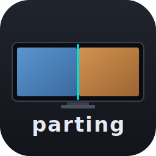
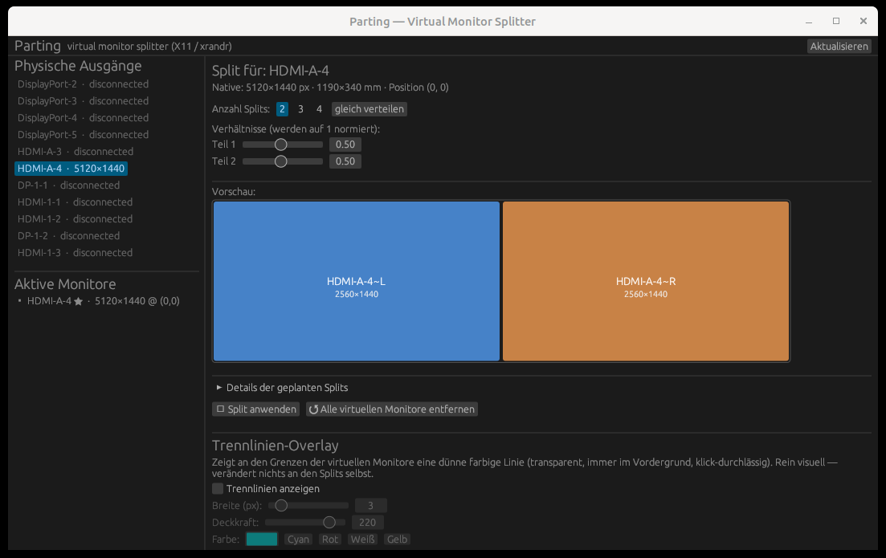

<p align="center">
  
</p>

<h1 align="center">Parting</h1>

<p align="center">
  Virtual monitor splitter for ultrawide displays on Linux / X11.
</p>

---

**Parting** carves one physical display into several logical monitors your window
manager treats as if they were separate screens. Snap a window with `Super+←` or
your usual tiling shortcut and it lands on a half of the screen instead of the
whole ultrawide — no compromises, no hacks in every application.



## Features

- **Split any connected output** into 2, 3 or 4 virtual monitors with adjustable
  ratios. Applied through `xrandr --setmonitor`, picked up by every X11 WM.
- **Live preview** of the split geometry before you commit.
- **Divider overlays**: thin, always-on-top, click-through, transparent lines at
  the boundaries — colour, width and opacity configurable.
- **Window snap daemon**: drop a window near a virtual boundary and it docks to
  the correct half automatically.
- **Detects and lists** all physical outputs and active monitors, including
  virtual ones created by Parting.

## Requirements

- Linux with X11 (tested on Linux Mint 21.3 / Cinnamon)
- `xrandr` in `PATH`
- Rust toolchain (edition 2021) to build

Wayland is not supported — Parting talks to X11 directly and shells out to
`xrandr`.

## Build & run

```bash
cargo run --release
```

The compiled binary is at `target/release/parting`.

## Usage

1. Pick a connected output on the left panel.
2. Choose the split count (2 / 3 / 4) and drag the ratio sliders.
3. Click **Split anwenden** — the virtual monitors appear immediately.
4. Optionally enable divider overlays and window snapping.
5. **Alle virtuellen Monitore entfernen** removes every Parting split at once.

## How it works

Parting uses `xrandr --setmonitor` to declare virtual monitor regions that
overlay a real output. Because these regions are advertised through the standard
RandR monitor list, tiling window managers, docks and pagers treat them as
independent screens — no per-app configuration needed.

The snap daemon watches window drag/drop events over X11 and repositions the
active window when it is released close to a virtual boundary.

## License

MIT — see [LICENSE](LICENSE).